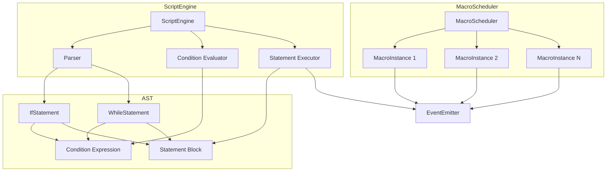

# Design Document: Macro and Script Enhancements

## Overview

本设计文档描述了 PS5GamePadMapper 宏系统和脚本引擎的增强功能实现。主要包括三个核心增强：

1. **多宏并行执行** - 重构 MacroScheduler 以支持多个宏实例同时运行
2. **脚本控制流** - 扩展 ScriptEngine 以支持 if/else 和 while 语句
3. **宏条件循环** - 添加 whileCondition 宏类型支持基于条件的循环

设计原则：
- **向后兼容**: 现有 API 保持不变，新功能作为扩展添加
- **状态隔离**: 每个宏实例维护独立状态
- **可测试性**: 所有新功能都可通过属性测试验证

## Architecture



## Components and Interfaces

### 1. MacroInstance

表示正在执行的宏的运行时实例。

```swift
/// A running macro instance with its own state
public final class MacroInstance: Identifiable {
    public let id: UUID
    public let macro: Macro
    public private(set) var currentStep: Int
    public private(set) var pressedKeys: Set<UInt16>
    public private(set) var isRunning: Bool
    public private(set) var loopCount: Int
    
    /// For whileCondition macros
    public var conditionEvaluator: (() -> Bool)?
}
```

### 2. Enhanced MacroScheduler

扩展 MacroScheduler 以支持并行执行。

```swift
public protocol MacroSchedulerProtocol {
    /// All currently running macro instances
    var runningInstances: [MacroInstance] { get }
    
    /// Execute a macro, returns the instance ID
    func execute(_ macro: Macro, trigger: TriggerMode) -> UUID
    
    /// Stop a specific macro instance
    func stop(instanceId: UUID)
    
    /// Interrupt a specific macro instance
    func interrupt(instanceId: UUID)
    
    /// Interrupt all running macros
    func interruptAll()
}
```

### 3. Script AST Nodes

脚本抽象语法树节点。

```swift
/// Base protocol for all AST nodes
public protocol ASTNode {}

/// A statement that can be executed
public protocol Statement: ASTNode {}

/// A condition expression that evaluates to boolean
public indirect enum ConditionExpression: Equatable {
    case buttonPressed(button: String)
    case boolLiteral(Bool)
    case intComparison(left: IntExpression, op: ComparisonOperator, right: IntExpression)
    case not(ConditionExpression)
    case and(ConditionExpression, ConditionExpression)
    case or(ConditionExpression, ConditionExpression)
}

public enum ComparisonOperator: String, Equatable {
    case equal = "=="
    case notEqual = "!="
    case lessThan = "<"
    case greaterThan = ">"
    case lessOrEqual = "<="
    case greaterOrEqual = ">="
}

public enum IntExpression: Equatable {
    case literal(Int)
    case variable(String)
}

/// If statement with optional else block
public struct IfStatement: Statement, Equatable {
    public let condition: ConditionExpression
    public let thenBlock: [Statement]
    public let elseBlock: [Statement]?
}

/// While loop statement
public struct WhileStatement: Statement, Equatable {
    public let condition: ConditionExpression
    public let body: [Statement]
}

/// Break statement for exiting loops
public struct BreakStatement: Statement, Equatable {}

/// Continue statement for skipping to next iteration
public struct ContinueStatement: Statement, Equatable {}

/// Function call statement (existing commands)
public struct FunctionCallStatement: Statement, Equatable {
    public let name: String
    public let arguments: [String]
}
```

### 4. Enhanced ScriptEngine

扩展 ScriptEngine 以支持控制流。

```swift
public protocol ScriptEngineProtocol {
    /// Parse script source into AST
    func parse(_ source: String) throws -> [Statement]
    
    /// Execute parsed statements
    func execute(_ statements: [Statement], context: ScriptContext) async throws
    
    /// Execute script (parse + execute)
    func execute(_ script: Script, context: ScriptContext) async throws
}

/// Execution result for control flow
public enum ExecutionControl {
    case normal
    case breakLoop
    case continueLoop
}
```

### 5. Condition Evaluator

条件表达式求值器。

```swift
public protocol ConditionEvaluatorProtocol {
    /// Evaluate a condition expression
    func evaluate(_ condition: ConditionExpression, context: ScriptContext) -> Bool
}

public final class ConditionEvaluator: ConditionEvaluatorProtocol {
    public func evaluate(_ condition: ConditionExpression, context: ScriptContext) -> Bool {
        switch condition {
        case .buttonPressed(let button):
            return context.isButtonPressed(button)
        case .boolLiteral(let value):
            return value
        case .intComparison(let left, let op, let right):
            return evaluateComparison(left, op, right, context: context)
        case .not(let expr):
            return !evaluate(expr, context: context)
        case .and(let left, let right):
            return evaluate(left, context: context) && evaluate(right, context: context)
        case .or(let left, let right):
            return evaluate(left, context: context) || evaluate(right, context: context)
        }
    }
}
```

### 6. WhileCondition Macro Type

扩展 MacroType 以支持条件循环。

```swift
public enum MacroType: Codable, Equatable {
    case sequence
    case loop(interval: Int, maxCount: Int)
    case toggle
    case whileCondition(condition: String)  // New: condition expression as string
}
```

## Data Models

### Macro Instance State

```swift
public struct MacroInstanceState: Equatable {
    public let instanceId: UUID
    public let macroId: UUID
    public let macroName: String
    public let currentStep: Int
    public let totalSteps: Int
    public let isRunning: Bool
    public let loopCount: Int
    public let pressedKeys: Set<UInt16>
}
```

### Script Parse Result

```swift
public struct ParseResult {
    public let statements: [Statement]
    public let errors: [ParseError]
}

public struct ParseError: Error, Equatable {
    public let line: Int
    public let column: Int
    public let message: String
}
```

## Correctness Properties

*A property is a characteristic or behavior that should hold true across all valid executions of a system-essentially, a formal statement about what the system should do. Properties serve as the bridge between human-readable specifications and machine-verifiable correctness guarantees.*

### Property 1: Parallel Macro Independence

*For any* two macros executed concurrently, each macro instance SHALL maintain independent state, and the completion or interruption of one SHALL NOT affect the other's execution.

**Validates: Requirements 1.1, 1.2, 1.3**

### Property 2: Targeted Macro Interruption

*For any* set of running macro instances, interrupting a specific instance by ID SHALL stop only that instance and release only its pressed keys, while other instances continue unaffected.

**Validates: Requirements 1.4**

### Property 3: Global Macro Interruption

*For any* set of running macro instances, calling interruptAll SHALL stop all instances and release all pressed keys from all instances.

**Validates: Requirements 1.5**

### Property 4: Running Macros Query Accuracy

*For any* set of started macros, the runningInstances query SHALL return exactly the macros that are currently executing with accurate state information.

**Validates: Requirements 1.6**

### Property 5: Control Flow Parsing Round-Trip

*For any* valid script containing if/else and while statements, parsing the script and then pretty-printing the AST SHALL produce a semantically equivalent script.

**Validates: Requirements 2.1, 2.2, 3.1**

### Property 6: Condition Expression Evaluation

*For any* condition expression with button states, comparison operators, and logical operators, the evaluation result SHALL match the expected boolean logic.

**Validates: Requirements 2.3, 2.4, 2.5, 3.2**

### Property 7: If Statement Execution

*For any* if statement with a condition:
- When condition is true, exactly the then-block statements SHALL execute
- When condition is false and else-block exists, exactly the else-block statements SHALL execute
- When condition is false and no else-block, no statements SHALL execute

**Validates: Requirements 2.6, 2.7**

### Property 8: While Loop Iteration Count

*For any* while loop where the condition becomes false after N iterations (N >= 0), the loop body SHALL execute exactly N times.

**Validates: Requirements 3.3, 3.4**

### Property 9: Break Statement Behavior

*For any* while loop containing a break statement, when break is reached, the loop SHALL exit immediately without completing the current iteration or checking the condition again.

**Validates: Requirements 3.5**

### Property 10: Continue Statement Behavior

*For any* while loop containing a continue statement, when continue is reached, the remaining statements in the current iteration SHALL be skipped and the next iteration SHALL begin.

**Validates: Requirements 3.6**

### Property 11: WhileCondition Macro Execution

*For any* whileCondition macro where the condition becomes false after N iterations, the macro steps SHALL execute exactly N times.

**Validates: Requirements 4.2, 4.3, 4.4**

### Property 12: WhileCondition Button State Integration

*For any* whileCondition macro with a button state condition, the condition evaluation SHALL reflect the current controller button state at each iteration.

**Validates: Requirements 4.5**

### Property 13: WhileCondition Macro Serialization Round-Trip

*For any* valid whileCondition macro, serializing to JSON and deserializing SHALL produce an equivalent macro with the same condition expression.

**Validates: Requirements 4.6**

## Error Handling

### MacroScheduler Errors

| Error | Handling Strategy |
|-------|-------------------|
| Invalid instance ID | Return silently, log warning |
| Condition parse error | Reject macro, return error |
| Condition evaluation error | Stop macro, release keys, log error |

### ScriptEngine Errors

| Error | Handling Strategy |
|-------|-------------------|
| Syntax error in control flow | Return ParseError with line/column |
| Invalid condition expression | Return ParseError with details |
| Infinite loop detection | Timeout after configurable limit |
| Break/continue outside loop | Return ParseError |

## Testing Strategy

### Testing Framework

- **Unit Testing**: XCTest (Swift 内置)
- **Property-Based Testing**: SwiftCheck

### Property-Based Testing Approach

1. **Generator Strategy**: 
   - Generate random macro pairs for parallel execution tests
   - Generate random condition expressions with varying complexity
   - Generate random scripts with nested control flow

2. **Iteration Count**: Each property test will run minimum 100 iterations

3. **Annotation Format**: `// **Feature: macro-script-enhancements, Property {N}: {description}**`

### Test Organization

```
Tests/
├── Property/
│   ├── ParallelMacroPropertyTests.swift
│   ├── ControlFlowParsingPropertyTests.swift
│   ├── ConditionEvaluationPropertyTests.swift
│   ├── IfStatementPropertyTests.swift
│   ├── WhileLoopPropertyTests.swift
│   ├── WhileConditionMacroPropertyTests.swift
│   └── WhileConditionSerializationPropertyTests.swift
└── Generators/
    ├── ConditionExpressionGenerator.swift
    ├── StatementGenerator.swift
    └── MacroInstanceGenerator.swift
```

### Mocking Strategy

- Use `MockEventEmitter` to capture emitted events
- Use `MockScriptContext` with configurable button states
- Use `MockConditionEvaluator` for deterministic condition results
