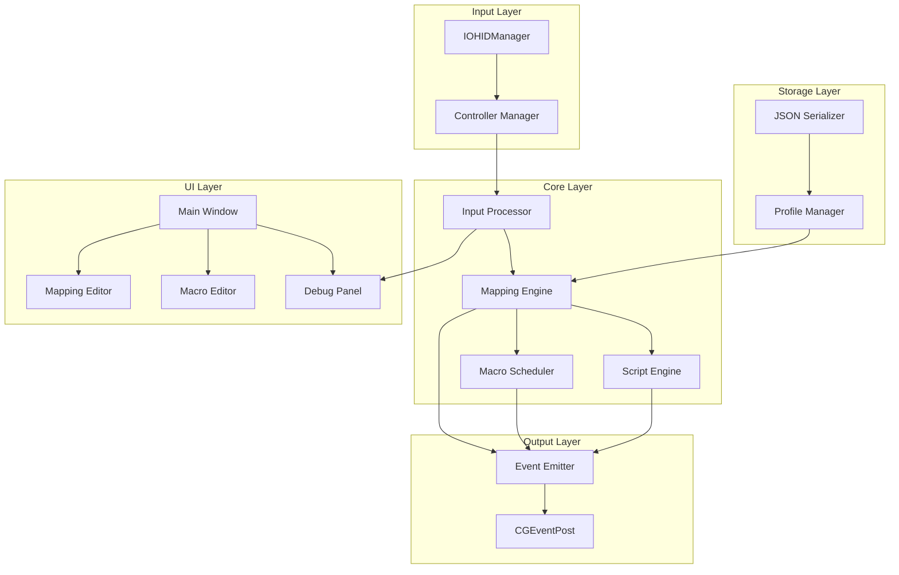

# Design Document: PS5 GamePad Mapper

## Overview

PS5GamePadMapper 是一个 macOS 原生应用，用于将 PS5 DualSense 手柄输入映射为键盘/鼠标事件。系统采用分层架构，将输入读取、映射处理、事件输出、宏执行等功能模块化，确保低延迟和高可扩展性。

核心设计原则：
- **低延迟**: 输入到输出延迟 < 30ms
- **模块化**: 各层职责清晰，便于测试和维护
- **可配置**: 所有映射参数可通过 Profile 保存和切换
- **开发者友好**: 提供调试面板和脚本能力

## Architecture



### 层次说明

1. **Input Layer**: 负责与硬件通信，读取手柄原始输入
2. **Core Layer**: 核心业务逻辑，包括输入处理、映射引擎、宏调度、脚本执行
3. **Output Layer**: 负责将处理后的动作转换为系统事件
4. **Storage Layer**: 负责配置的持久化和加载
5. **UI Layer**: 用户界面，提供配置和调试功能

## Components and Interfaces

### 1. Controller Manager

负责手柄设备的发现、连接和状态管理。

```swift
protocol ControllerManagerProtocol {
    var connectedControllers: [Controller] { get }
    var onControllerConnected: ((Controller) -> Void)? { get set }
    var onControllerDisconnected: ((Controller) -> Void)? { get set }
    
    func startDiscovery()
    func stopDiscovery()
}

struct Controller {
    let deviceId: String
    let name: String
    let connectionType: ConnectionType
    let batteryLevel: Int?
}

enum ConnectionType {
    case usb
    case bluetooth
}
```

### 2. Input Processor

处理原始输入数据，进行归一化和死区处理。

```swift
protocol InputProcessorProtocol {
    func processButtonInput(_ input: RawButtonInput) -> ButtonEvent
    func processAxisInput(_ input: RawAxisInput, config: AxisConfig) -> AxisEvent
}

struct RawButtonInput {
    let button: ButtonType
    let isPressed: Bool
    let timestamp: UInt64
}

struct RawAxisInput {
    let axis: AxisType
    let rawValue: Int16  // -32768 to 32767 for sticks, 0-255 for triggers
    let timestamp: UInt64
}

struct ButtonEvent {
    let button: ButtonType
    let state: ButtonState
    let holdDuration: TimeInterval?
}

struct AxisEvent {
    let axis: AxisType
    let normalizedValue: Double  // -1.0 to 1.0 or 0.0 to 1.0
}

struct AxisConfig {
    let deadzone: Double      // 0.0 to 0.5
    let sensitivity: Double   // 0.1 to 10.0
    let curve: ResponseCurve
}

enum ResponseCurve {
    case linear
    case exponential(power: Double)
}
```

### 3. Mapping Engine

核心映射逻辑，将输入事件转换为动作。

```swift
protocol MappingEngineProtocol {
    var activeProfile: Profile? { get set }
    
    func handleButtonEvent(_ event: ButtonEvent) -> [Action]
    func handleAxisEvent(_ event: AxisEvent) -> [Action]
}

struct Mapping {
    let input: InputSource
    let trigger: TriggerMode
    let action: Action
}

enum InputSource {
    case button(ButtonType)
    case axis(AxisType)
}

enum TriggerMode {
    case press
    case release
    case hold(threshold: TimeInterval)
    case toggle
}

enum Action {
    case keyPress(KeyAction)
    case mouseButton(MouseButtonAction)
    case mouseMove(MouseMoveAction)
    case mouseScroll(MouseScrollAction)
    case macro(Macro)
    case script(Script)
}

struct KeyAction {
    let keyCode: UInt16
    let modifiers: KeyModifiers
}

struct KeyModifiers: OptionSet {
    let rawValue: UInt32
    static let command = KeyModifiers(rawValue: 1 << 0)
    static let control = KeyModifiers(rawValue: 1 << 1)
    static let option = KeyModifiers(rawValue: 1 << 2)
    static let shift = KeyModifiers(rawValue: 1 << 3)
}
```

### 4. Macro System

宏定义和执行。

```swift
struct Macro: Codable, Equatable {
    let id: UUID
    let name: String
    let steps: [MacroStep]
    let type: MacroType
}

enum MacroType: Codable, Equatable {
    case sequence
    case loop(interval: Int, maxCount: Int)  // maxCount 0 = infinite
    case toggle
}

enum MacroStep: Codable, Equatable {
    case keyDown(keyCode: UInt16)
    case keyUp(keyCode: UInt16)
    case mouseClick(button: MouseButton)
    case mouseMove(dx: Int, dy: Int)
    case delay(milliseconds: Int)
}

protocol MacroSchedulerProtocol {
    var isRunning: Bool { get }
    var currentStep: Int? { get }
    
    func execute(_ macro: Macro, trigger: TriggerMode)
    func stop()
    func interrupt()
}
```

### 5. Script Engine

脚本执行引擎。

```swift
protocol ScriptEngineProtocol {
    func execute(_ script: Script, context: ScriptContext) async throws
}

struct Script: Codable, Equatable {
    let id: UUID
    let name: String
    let source: String
}

protocol ScriptContext {
    func pressKey(_ key: String)
    func releaseKey(_ key: String)
    func tapKey(_ key: String, duration: Int)
    func mouseClick(_ button: String)
    func mouseMove(dx: Int, dy: Int)
    func sleep(_ milliseconds: Int) async
    func isButtonPressed(_ button: String) -> Bool
}
```

### 6. Event Emitter

系统事件发射器。

```swift
protocol EventEmitterProtocol {
    func emitKeyDown(_ keyCode: UInt16, modifiers: KeyModifiers)
    func emitKeyUp(_ keyCode: UInt16, modifiers: KeyModifiers)
    func emitMouseDown(_ button: MouseButton)
    func emitMouseUp(_ button: MouseButton)
    func emitMouseMove(dx: CGFloat, dy: CGFloat)
    func emitMouseScroll(dx: CGFloat, dy: CGFloat)
}
```

### 7. Profile Manager

配置文件管理。

```swift
protocol ProfileManagerProtocol {
    var profiles: [Profile] { get }
    var activeProfile: Profile? { get }
    
    func loadProfile(_ name: String) throws -> Profile
    func saveProfile(_ profile: Profile) throws
    func deleteProfile(_ name: String) throws
    func cloneProfile(_ profile: Profile, newName: String) throws -> Profile
    func setActiveProfile(_ profile: Profile)
}

struct Profile: Codable, Equatable {
    let id: UUID
    var name: String
    var mappings: [Mapping]
    var macros: [Macro]
    var scripts: [Script]
    var applicationBindings: [ApplicationBinding]?
}

struct ApplicationBinding: Codable, Equatable {
    let bundleIdentifier: String
    let profileId: UUID
}
```

## Data Models

### Button Types

```swift
enum ButtonType: String, Codable, CaseIterable {
    case cross = "X"
    case circle = "O"
    case square = "Square"
    case triangle = "Triangle"
    case l1 = "L1"
    case r1 = "R1"
    case l2 = "L2"
    case r2 = "R2"
    case l3 = "L3"
    case r3 = "R3"
    case dpadUp = "DPad_Up"
    case dpadDown = "DPad_Down"
    case dpadLeft = "DPad_Left"
    case dpadRight = "DPad_Right"
    case share = "Share"
    case options = "Options"
    case ps = "PS"
    case touchpad = "Touchpad"
}
```

### Axis Types

```swift
enum AxisType: String, Codable, CaseIterable {
    case leftStickX = "LStick_X"
    case leftStickY = "LStick_Y"
    case rightStickX = "RStick_X"
    case rightStickY = "RStick_Y"
    case l2Trigger = "L2_Trigger"
    case r2Trigger = "R2_Trigger"
}
```

### JSON Schema for Profile

```json
{
  "$schema": "http://json-schema.org/draft-07/schema#",
  "type": "object",
  "properties": {
    "id": { "type": "string", "format": "uuid" },
    "name": { "type": "string" },
    "mappings": {
      "type": "array",
      "items": {
        "type": "object",
        "properties": {
          "input": { "type": "string" },
          "trigger": { "type": "string", "enum": ["press", "release", "hold", "toggle"] },
          "action": { "type": "object" }
        }
      }
    },
    "macros": {
      "type": "array",
      "items": {
        "type": "object",
        "properties": {
          "id": { "type": "string", "format": "uuid" },
          "name": { "type": "string" },
          "steps": { "type": "array" },
          "type": { "type": "string" }
        }
      }
    }
  },
  "required": ["id", "name", "mappings"]
}
```

## Correctness Properties

*A property is a characteristic or behavior that should hold true across all valid executions of a system-essentially, a formal statement about what the system should do. Properties serve as the bridge between human-readable specifications and machine-verifiable correctness guarantees.*

Based on the prework analysis, the following correctness properties have been identified:

### Property 1: Axis Normalization Bounds

*For any* raw axis input value, the normalized output SHALL be within the valid range: -1.0 to 1.0 for stick axes, and 0.0 to 1.0 for trigger axes.

**Validates: Requirements 3.2**

### Property 2: Deadzone Zeroing

*For any* axis input value that falls within the configured deadzone threshold, the processed output SHALL be exactly zero.

**Validates: Requirements 3.4**

### Property 3: Modifier Key Ordering

*For any* key action with modifiers, when emitting the key event sequence, all modifier keys (Cmd, Ctrl, Alt, Shift) SHALL be emitted before the primary key.

**Validates: Requirements 4.4**

### Property 4: Axis-to-Key Threshold Behavior

*For any* axis value and configured threshold:
- When the axis value exceeds the positive threshold, the positive direction key SHALL be pressed
- When the axis value exceeds the negative threshold, the negative direction key SHALL be pressed
- When the axis value returns below the threshold, the corresponding key SHALL be released

**Validates: Requirements 7.1, 7.2, 7.3**

### Property 5: Axis Parameter Validation

*For any* axis-to-mouse mapping configuration:
- Sensitivity values outside the range 0.1 to 10.0 SHALL be rejected
- Deadzone values outside the range 0.0 to 0.5 SHALL be rejected

**Validates: Requirements 6.2, 6.3**

### Property 6: Response Curve Behavior

*For any* axis input with configured response curve:
- Linear curve SHALL produce output proportional to input (output = input * sensitivity)
- Exponential curve SHALL produce output following the power function (output = sign(input) * |input|^power * sensitivity)

**Validates: Requirements 6.4**

### Property 7: Macro Serialization Round-Trip

*For any* valid Macro object, serializing to JSON and then deserializing SHALL produce an equivalent Macro with identical steps, delays, and configuration.

**Validates: Requirements 8.5, 8.6**

### Property 8: Macro Step Order Preservation

*For any* sequence macro execution, the steps SHALL be executed in the exact order they are defined, with no reordering or skipping.

**Validates: Requirements 8.1**

### Property 9: Loop Macro Repeat Count

*For any* loop macro with a maximum repeat count N (where N > 0), the macro SHALL execute exactly N iterations before stopping.

**Validates: Requirements 9.4**

### Property 10: Toggle Macro State Machine

*For any* toggle macro:
- First trigger press SHALL transition from stopped to running state
- Second trigger press while running SHALL transition from running to stopped state
- The state SHALL alternate with each trigger press

**Validates: Requirements 10.1, 10.2**

### Property 11: Macro Interruption Key Release

*For any* macro that is interrupted while keys are pressed, all keys that were pressed by the macro SHALL be released upon interruption.

**Validates: Requirements 11.2**

### Property 12: Script API Key Events

*For any* key specified in script API calls:
- pressKey(key) SHALL emit exactly one key down event for that key
- releaseKey(key) SHALL emit exactly one key up event for that key
- tapKey(key, ms) SHALL emit one key down event followed by one key up event

**Validates: Requirements 12.2, 12.3, 12.4**

### Property 13: Script API Mouse Events

*For any* mouse action specified in script API calls:
- mouseClick(button) SHALL emit a complete click (down + up) for the specified button
- mouseMove(dx, dy) SHALL emit a relative movement event with the exact delta values

**Validates: Requirements 12.5, 12.6**

### Property 14: Script Button State Query

*For any* button and its current physical state, isButtonPressed(btn) SHALL return true if and only if the button is currently pressed on the controller.

**Validates: Requirements 12.8**

### Property 15: Profile Serialization Round-Trip

*For any* valid Profile object, serializing to JSON and then deserializing SHALL produce an equivalent Profile with identical mappings, macros, scripts, and settings.

**Validates: Requirements 13.6, 13.7**

### Property 16: Profile Clone Identity

*For any* profile clone operation, the cloned profile SHALL have:
- Identical mappings to the original
- Identical macros to the original
- A different name from the original
- A different UUID from the original

**Validates: Requirements 13.4**

### Property 17: Debug Panel Axis Precision

*For any* axis value displayed in the debug panel, the displayed string SHALL show exactly 2 decimal places of precision.

**Validates: Requirements 15.4**

## Error Handling

### Input Layer Errors

| Error | Handling Strategy |
|-------|-------------------|
| Controller disconnection | Emit disconnection event, pause all mappings, attempt reconnection |
| HID read failure | Log error, continue with next input cycle |
| Invalid HID data | Discard packet, log warning |

### Mapping Layer Errors

| Error | Handling Strategy |
|-------|-------------------|
| Invalid mapping configuration | Reject configuration, return validation error |
| Missing action handler | Log error, skip action |

### Macro Execution Errors

| Error | Handling Strategy |
|-------|-------------------|
| Invalid macro step | Skip step, log error, continue execution |
| Execution timeout | Interrupt macro, release all keys |
| Script syntax error | Display error in UI, prevent execution |

### Storage Errors

| Error | Handling Strategy |
|-------|-------------------|
| Profile file not found | Return error, use default profile |
| JSON parse error | Return detailed error with line number |
| File write failure | Return error, preserve in-memory state |

### Permission Errors

| Error | Handling Strategy |
|-------|-------------------|
| Accessibility not granted | Show permission dialog, disable event emission |
| Bluetooth not authorized | Show permission dialog, disable BT discovery |

## Testing Strategy

### Testing Framework

- **Unit Testing**: XCTest (Swift 内置)
- **Property-Based Testing**: SwiftCheck (https://github.com/typelift/SwiftCheck)

### Unit Testing Approach

Unit tests will cover:
- Specific examples demonstrating correct behavior
- Edge cases (empty inputs, boundary values)
- Error conditions and exception handling
- Integration points between components

Example unit test areas:
- Controller connection/disconnection handling
- Specific button mappings
- Macro step execution order
- Profile loading from specific JSON files

### Property-Based Testing Approach

Property-based tests will verify universal properties using SwiftCheck:

1. **Generator Strategy**: Create smart generators that produce valid inputs within specified ranges
2. **Iteration Count**: Each property test will run minimum 100 iterations
3. **Annotation Format**: Each test will be annotated with `// **Feature: ps5-gamepad-mapper, Property {N}: {description}**`

Property test coverage:
- Axis normalization (Property 1, 2)
- Key event ordering (Property 3)
- Threshold behavior (Property 4)
- Parameter validation (Property 5)
- Serialization round-trips (Property 7, 15)
- State machine transitions (Property 10)

### Test Organization

```
Tests/
├── Unit/
│   ├── ControllerManagerTests.swift
│   ├── InputProcessorTests.swift
│   ├── MappingEngineTests.swift
│   ├── MacroSchedulerTests.swift
│   ├── ScriptEngineTests.swift
│   ├── EventEmitterTests.swift
│   └── ProfileManagerTests.swift
├── Property/
│   ├── AxisNormalizationPropertyTests.swift
│   ├── MacroSerializationPropertyTests.swift
│   ├── ProfileSerializationPropertyTests.swift
│   ├── ThresholdBehaviorPropertyTests.swift
│   └── StateMachinePropertyTests.swift
└── Generators/
    ├── AxisInputGenerator.swift
    ├── MacroGenerator.swift
    └── ProfileGenerator.swift
```

### Mocking Strategy

- Use protocol-based dependency injection for all components
- Create mock implementations for:
  - `EventEmitterProtocol` (capture emitted events for verification)
  - `ControllerManagerProtocol` (simulate controller events)
  - `ScriptContext` (track script API calls)
