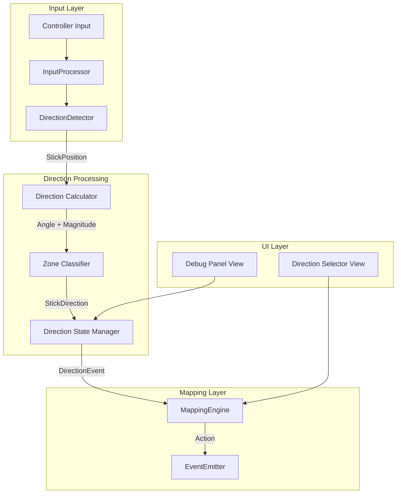
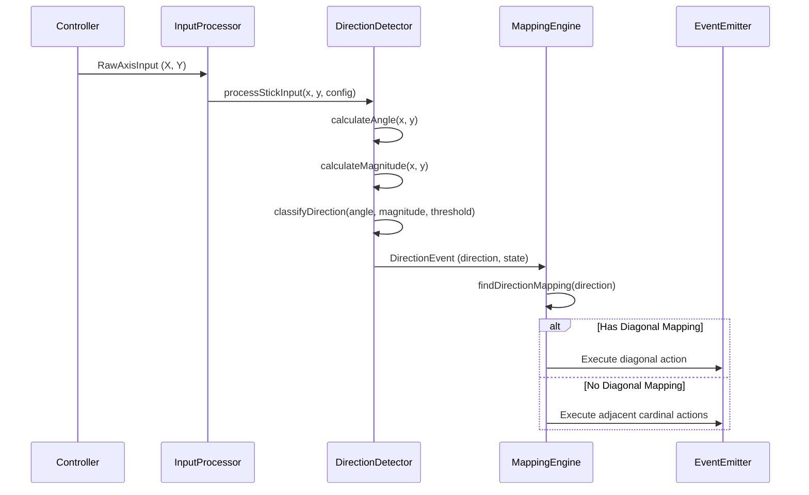

# Design Document: Stick Direction Mapping

## Overview

本设计文档描述了 PS5GamePadMapper 的摇杆方向独立配置功能。该功能扩展现有的输入映射系统，支持将摇杆的 8 个方向（上、下、左、右、左上、右上、左下、右下）分别映射到不同的动作，满足 WASD 风格移动控制和方向性特殊动作的需求。

### Design Goals

1. **向后兼容**: 保持现有轴映射功能不变，方向映射作为可选的高级功能
2. **精确检测**: 使用角度计算实现准确的 8 方向识别
3. **灵活配置**: 支持对角方向的独立映射或回退到相邻基本方向
4. **无缝集成**: 与现有的 Profile、Mapping、Action 系统完全集成

## Architecture

### High-Level Architecture



### Component Interaction Flow



## Components and Interfaces

### 1. StickDirection Enum

新增枚举类型表示 8 个摇杆方向。

```swift
/// 摇杆方向枚举
/// Requirements: 1.1 - 8 distinct directions
public enum StickDirection: String, Codable, CaseIterable, Equatable, Hashable {
    case up = "Up"
    case down = "Down"
    case left = "Left"
    case right = "Right"
    case upLeft = "UpLeft"
    case upRight = "UpRight"
    case downLeft = "DownLeft"
    case downRight = "DownRight"
    
    /// 是否为基本方向
    public var isCardinal: Bool {
        switch self {
        case .up, .down, .left, .right: return true
        default: return false
        }
    }
    
    /// 是否为对角方向
    public var isDiagonal: Bool {
        return !isCardinal
    }
    
    /// 获取对角方向的相邻基本方向
    public var adjacentCardinals: [StickDirection] {
        switch self {
        case .upLeft: return [.up, .left]
        case .upRight: return [.up, .right]
        case .downLeft: return [.down, .left]
        case .downRight: return [.down, .right]
        default: return []
        }
    }
    
    /// 方向对应的角度范围中心（度）
    public var centerAngle: Double {
        switch self {
        case .right: return 0
        case .upRight: return 45
        case .up: return 90
        case .upLeft: return 135
        case .left: return 180
        case .downLeft: return 225
        case .down: return 270
        case .downRight: return 315
        }
    }
}
```

### 2. StickType Enum

标识左右摇杆。

```swift
/// 摇杆类型
public enum StickType: String, Codable, Equatable, Hashable {
    case left = "LeftStick"
    case right = "RightStick"
}
```

### 3. DirectionInput Model

扩展 InputSource 以支持方向输入。

```swift
/// 方向输入源
/// Requirements: 2.1 - Direction as input source
public struct DirectionInput: Codable, Equatable, Hashable {
    public let stick: StickType
    public let direction: StickDirection
    public let threshold: Double  // 0.1 to 0.9
    
    public init(stick: StickType, direction: StickDirection, threshold: Double = 0.5) {
        self.stick = stick
        self.direction = direction
        self.threshold = max(0.1, min(0.9, threshold))
    }
}

/// 扩展 InputSource 支持方向
public enum InputSource: Codable, Equatable {
    case button(ButtonType)
    case axis(AxisType)
    case direction(DirectionInput)  // 新增
}
```

### 4. DirectionEvent Model

方向事件，类似于 ButtonEvent。

```swift
/// 方向事件
/// Requirements: 1.5, 2.4 - Direction press/release events
public struct DirectionEvent: Equatable {
    public let stick: StickType
    public let direction: StickDirection
    public let state: DirectionState
    public let angle: Double      // 当前角度（度）
    public let magnitude: Double  // 当前幅度 (0.0-1.0)
    
    public init(stick: StickType, direction: StickDirection, state: DirectionState, 
                angle: Double, magnitude: Double) {
        self.stick = stick
        self.direction = direction
        self.state = state
        self.angle = angle
        self.magnitude = magnitude
    }
}

/// 方向状态
public enum DirectionState: Equatable {
    case pressed
    case released
    case held
}
```

### 5. DirectionDetector Class

核心方向检测组件。

```swift
/// 方向检测器
/// Requirements: 6.1, 6.2, 6.3, 6.4, 6.5
public final class DirectionDetector {
    
    /// 方向配置
    public struct Config {
        public let deadzone: Double      // 死区阈值
        public let threshold: Double     // 方向激活阈值
        public let cardinalAngle: Double // 基本方向角度范围 (默认 22.5°)
        
        public init(deadzone: Double = 0.1, threshold: Double = 0.5, cardinalAngle: Double = 22.5) {
            self.deadzone = deadzone
            self.threshold = max(0.1, min(0.9, threshold))
            self.cardinalAngle = cardinalAngle
        }
    }
    
    // 当前活跃方向状态
    private var activeDirections: [StickType: Set<StickDirection>] = [:]
    
    /// 处理摇杆输入
    /// Returns: 产生的方向事件列表
    public func processStickInput(x: Double, y: Double, stick: StickType, config: Config) -> [DirectionEvent]
    
    /// 计算角度（度）
    /// Requirements: 6.1 - Use arctangent
    public func calculateAngle(x: Double, y: Double) -> Double
    
    /// 计算幅度
    public func calculateMagnitude(x: Double, y: Double) -> Double
    
    /// 根据角度分类方向
    /// Requirements: 1.3, 1.4 - Cardinal and diagonal classification
    public func classifyDirection(angle: Double, cardinalAngle: Double) -> StickDirection
    
    /// 重置状态
    public func reset()
}
```

### 6. MappingEngine Extensions

扩展映射引擎以支持方向映射。

```swift
extension MappingEngine {
    
    /// 处理方向事件
    /// Requirements: 2.2, 2.3, 5.2, 5.4
    public func handleDirectionEvent(_ event: DirectionEvent) -> [Action]
    
    /// 查找方向映射
    /// Requirements: 7.3 - Direction mappings take priority
    private func findDirectionMapping(stick: StickType, direction: StickDirection) -> Mapping?
    
    /// 处理对角方向回退
    /// Requirements: 5.3 - Fallback to adjacent cardinals
    private func handleDiagonalFallback(stick: StickType, direction: StickDirection, state: DirectionState) -> [Action]
}
```

### 7. DirectionSelectorView

方向选择器 UI 组件。

```swift
/// 方向选择器视图
/// Requirements: 3.1, 3.2, 3.3, 3.4
struct DirectionSelectorView: View {
    let stick: StickType
    let currentX: Double
    let currentY: Double
    let configuredDirections: Set<StickDirection>
    let onDirectionSelected: (StickDirection) -> Void
    
    var body: some View {
        // 8 方向选择器 UI
        // 显示当前摇杆位置
        // 高亮已配置的方向
    }
}
```

## Data Models

### Direction Mapping Configuration

```swift
/// 方向映射配置
public struct DirectionMappingConfig: Codable, Equatable {
    public let stick: StickType
    public let direction: StickDirection
    public let threshold: Double
    public let action: Action
    public let triggerMode: TriggerMode
    
    public init(stick: StickType, direction: StickDirection, threshold: Double = 0.5,
                action: Action, triggerMode: TriggerMode = .press) {
        self.stick = stick
        self.direction = direction
        self.threshold = max(0.1, min(0.9, threshold))
        self.action = action
        self.triggerMode = triggerMode
    }
}
```

### Profile Extension

```swift
/// Profile 扩展支持方向映射
extension Profile {
    // 现有 mappings 数组已支持 InputSource.direction
    // 无需额外字段，通过 InputSource 枚举区分
}
```

### JSON Serialization Format

```json
{
  "input": {
    "direction": {
      "stick": "LeftStick",
      "direction": "Up",
      "threshold": 0.5
    }
  },
  "trigger": "press",
  "action": {
    "keyPress": {
      "keyCode": 13,
      "modifiers": 0
    }
  }
}
```

## Correctness Properties

*A property is a characteristic or behavior that should hold true across all valid executions of a system-essentially, a formal statement about what the system should do. Properties serve as the bridge between human-readable specifications and machine-verifiable correctness guarantees.*

### Property 1: Direction Input Serialization Round-Trip

*For any* valid DirectionInput, serializing to JSON and deserializing should produce an equivalent DirectionInput with the same stick, direction, and threshold values.

**Validates: Requirements 1.6, 1.7**

### Property 2: Angle to Direction Classification

*For any* angle in degrees (0-360), the direction classifier should return the correct StickDirection based on the angle zones: cardinal directions within ±22.5° of their center angles (0°, 90°, 180°, 270°), and diagonal directions for the remaining 45° sectors.

**Validates: Requirements 1.3, 1.4**

### Property 3: Threshold-based Direction Activation

*For any* stick position (x, y) and threshold value, a direction should only be detected when the magnitude (sqrt(x² + y²)) exceeds the threshold. Positions with magnitude below the threshold should report no active direction.

**Validates: Requirements 1.2, 6.2, 6.3**

### Property 4: Direction State Transitions

*For any* sequence of stick positions, when transitioning from one direction to another, the system should emit release events for the old direction before press events for the new direction. When the stick is held in the same direction, no repeated press events should be emitted.

**Validates: Requirements 1.5, 2.4, 4.2, 4.3, 6.4, 6.5**

### Property 5: Diagonal Fallback to Cardinals

*For any* diagonal direction input where no diagonal mapping exists but adjacent cardinal mappings do, the system should trigger both adjacent cardinal direction mappings simultaneously.

**Validates: Requirements 4.4, 5.3**

### Property 6: Diagonal Priority over Cardinals

*For any* diagonal direction input where a diagonal mapping exists, the system should trigger only the diagonal mapping and not the adjacent cardinal mappings, even if cardinal mappings are configured.

**Validates: Requirements 5.4**

### Property 7: Profile Direction Mapping Round-Trip

*For any* Profile containing direction mappings, serializing to JSON and deserializing should produce an equivalent Profile with all direction mappings preserved, including stick type, direction, threshold, action, and trigger mode.

**Validates: Requirements 7.1, 7.2, 7.4, 7.5**

### Property 8: Direction Mapping Priority over Axis

*For any* Profile containing both axis mappings and direction mappings for the same stick, when processing stick input, direction mappings should take priority and axis mappings should not be triggered.

**Validates: Requirements 7.3**

### Property 9: Direction Threshold Validation

*For any* threshold value provided to DirectionInput, the stored threshold should be clamped to the valid range [0.1, 0.9].

**Validates: Requirements 2.5**

### Property 10: Debug Panel Stick State Formatting

*For any* stick position, the debug panel should display the angle in degrees (0-360) and magnitude as a value between 0.0 and 1.0 with appropriate precision.

**Validates: Requirements 8.2, 8.3**

## Error Handling

### Invalid Input Handling

| Error Condition | Handling Strategy |
|----------------|-------------------|
| Threshold out of range | Clamp to [0.1, 0.9] |
| Invalid JSON format | Return nil, log error |
| Unknown direction string | Return nil during deserialization |
| NaN/Infinity in coordinates | Treat as zero, no direction |

### State Recovery

- DirectionDetector maintains internal state for active directions
- On error, reset to neutral state (no active directions)
- Profile loading failures should not affect existing direction mappings

### Graceful Degradation

- If direction detection fails, fall back to standard axis behavior
- Missing direction mappings should not cause crashes
- UI should handle missing configurations gracefully

## Testing Strategy

### Property-Based Testing Framework

使用 SwiftCheck 进行属性测试，配置每个测试运行至少 100 次迭代。

### Unit Tests

1. **DirectionDetector Tests**
   - Angle calculation accuracy
   - Magnitude calculation accuracy
   - Direction classification for all 8 directions
   - Threshold boundary conditions

2. **Serialization Tests**
   - DirectionInput JSON round-trip
   - Profile with direction mappings round-trip
   - Backward compatibility with profiles without directions

3. **MappingEngine Tests**
   - Direction event handling
   - Diagonal fallback behavior
   - Direction priority over axis

### Property-Based Tests

每个属性测试必须使用以下格式标注：

```swift
// **Feature: stick-direction-mapping, Property 1: Direction Input Serialization Round-Trip**
// **Validates: Requirements 1.6, 1.7**
func testDirectionInputSerializationRoundTrip() {
    property("Direction input serializes and deserializes correctly") <- forAll { (input: DirectionInput) in
        let encoded = try? JSONEncoder().encode(input)
        let decoded = encoded.flatMap { try? JSONDecoder().decode(DirectionInput.self, from: $0) }
        return decoded == input
    }
}
```

### Test Generators

需要实现以下生成器：

1. **DirectionInputGenerator** - 生成随机 DirectionInput
2. **StickPositionGenerator** - 生成随机摇杆位置 (x, y)
3. **DirectionMappingGenerator** - 生成随机方向映射配置

### Integration Tests

1. End-to-end direction detection flow
2. Profile save/load with direction mappings
3. UI interaction with direction selector
