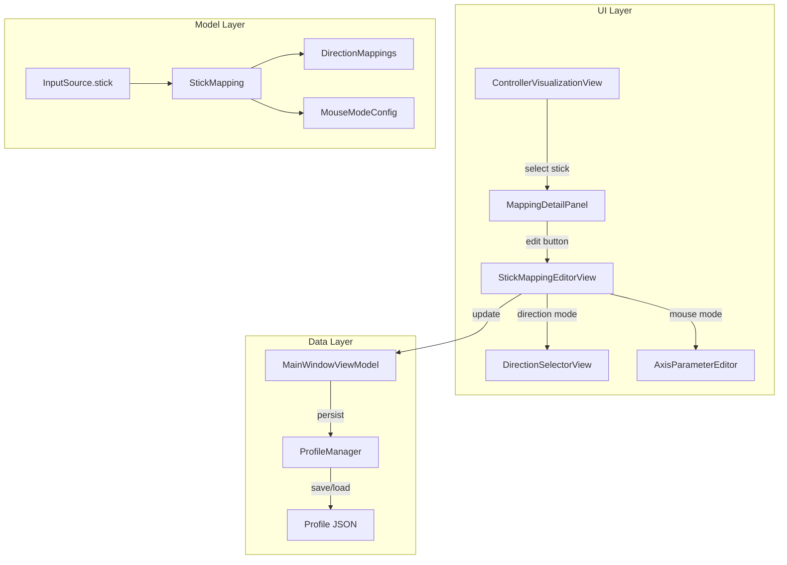
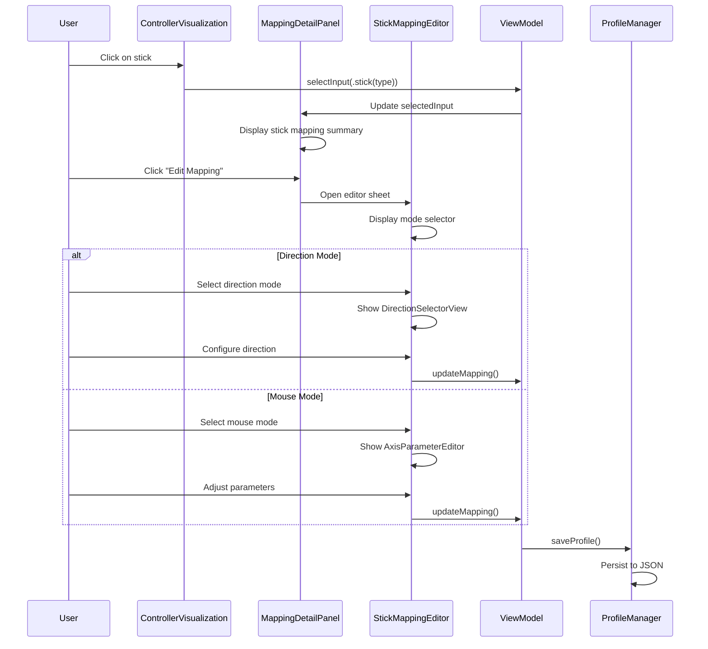

# Design Document: Stick Interaction Enhancement

## Overview

本设计文档描述了 PS5GamePadMapper 摇杆交互增强功能的技术实现方案。该功能旨在统一摇杆与按钮的交互模式，增加摇杆的鼠标移动映射功能，并优化映射详情的展示方式。

### Design Goals

1. **交互一致性**: 摇杆点击行为与按钮保持一致（选中 → 查看详情 → 编辑）
2. **功能完整性**: 支持方向模式和鼠标模式两种摇杆映射方式
3. **信息清晰性**: 在详情面板中以列表形式展示完整的方向映射信息
4. **代码复用**: 最大程度复用现有的 MappingEditorView、AxisParameterEditor 等组件

## UI/UX Design

### 当前交互流程 vs 改进后的交互流程

```
【当前流程 - 问题】
┌─────────────────────────────────────────────────────────────────┐
│  点击摇杆 ──────────────────────► 直接弹出8方向编辑器           │
│                                    (无法先查看当前配置)          │
└─────────────────────────────────────────────────────────────────┘

【改进后流程 - 与按钮一致】
┌─────────────────────────────────────────────────────────────────┐
│  点击摇杆 ──► 选中摇杆 ──► 右侧面板显示详情 ──► 点击编辑按钮    │
│              (蓝色边框)    (映射列表/参数)      ──► 打开编辑器   │
└─────────────────────────────────────────────────────────────────┘
```

### 主界面布局（改进后）

```
┌──────────────────────────────────────────────────────────────────────────┐
│  PS5GamePadMapper                                    [宏编辑器] [调试] [设置] │
├──────────────────────────────────────────────────────────────────────────┤
│  控制器: DualSense                              配置文件: [默认配置 ▼] [+] │
├────────────────────────────────────────┬─────────────────────────────────┤
│                                        │                                 │
│              控制器                     │          映射详情               │
│                                        │                                 │
│         ┌─────┐     ┌─────┐           │  ┌─────────────────────────┐    │
│         │ L2  │     │ R2  │           │  │ 输入                    │    │
│         └─────┘     └─────┘           │  │ 🎮 左摇杆               │    │
│       ┌───┐           ┌───┐           │  │ 类型: 摇杆              │    │
│       │L1 │           │R1 │           │  └─────────────────────────┘    │
│       └───┘           └───┘           │                                 │
│                                        │  ┌─────────────────────────┐    │
│    ╭───────╮      ┌───────────┐       │  │ 当前模式: 方向模式      │    │
│    │  ◉ L  │      │ Touchpad  │       │  │ 已配置: 4/8 方向        │    │
│    │ ═══   │      └───────────┘       │  └─────────────────────────┘    │
│    ╰───────╯                          │                                 │
│    [选中状态]     [Share] [PS] [Options]│  ┌─────────────────────────┐    │
│                                        │  │ 方向映射列表            │    │
│       ┌───┐                   △       │  ├─────────────────────────┤    │
│       │ ↑ │               ╭───────╮   │  │ ↑ 上    ⌨️ W            │    │
│     ┌─┼───┼─┐             │  ◉ R  │   │  │ ↓ 下    ⌨️ S            │    │
│     │←│   │→│             ╰───────╯   │  │ ← 左    ⌨️ A            │    │
│     └─┼───┼─┘               □ ○       │  │ → 右    ⌨️ D            │    │
│       │ ↓ │                 ✕         │  │ ↗ 右上  未配置          │    │
│       └───┘                           │  │ ↖ 左上  未配置          │    │
│                                        │  │ ↘ 右下  未配置          │    │
│                                        │  │ ↙ 左下  未配置          │    │
│                                        │  └─────────────────────────┘    │
│                                        │                                 │
│                                        │  ┌─────────────────────────┐    │
│                                        │  │     [ 编辑映射 ]        │    │
│                                        │  └─────────────────────────┘    │
└────────────────────────────────────────┴─────────────────────────────────┘
```

### 摇杆可视化状态

```
【未选中 + 无配置】        【选中状态】           【有方向映射】         【有鼠标映射】
   ╭───────╮              ╭═══════╮             ╭───────╮ ↗          ╭───────╮ 🖱
   │  ◉ L  │              ║  ◉ L  ║             │  ◉ L  │            │  ◉ L  │
   ╰───────╯              ╰═══════╯             ╰───────╯            ╰───────╯
                          (蓝色边框)            (绿色方向图标)       (紫色鼠标图标)
```

### 映射详情面板 - 方向模式

```
┌─────────────────────────────────┐
│ 映射详情                        │
├─────────────────────────────────┤
│                                 │
│ 输入                            │
│ ┌─────────────────────────────┐ │
│ │ 🎮 左摇杆                   │ │
│ │ 类型: 摇杆                  │ │
│ └─────────────────────────────┘ │
│                                 │
│ 当前模式                        │
│ ┌─────────────────────────────┐ │
│ │ ↗ 方向模式                  │ │
│ │ 已配置: 4/8 方向            │ │
│ └─────────────────────────────┘ │
│                                 │
│ 方向映射                        │
│ ┌─────────────────────────────┐ │
│ │ ↑ 上     ⌨️  W              │ │
│ ├─────────────────────────────┤ │
│ │ ↓ 下     ⌨️  S              │ │
│ ├─────────────────────────────┤ │
│ │ ← 左     ⌨️  A              │ │
│ ├─────────────────────────────┤ │
│ │ → 右     ⌨️  D              │ │
│ ├─────────────────────────────┤ │
│ │ ↗ 右上   ⌨️  ⇧+W            │ │
│ ├─────────────────────────────┤ │
│ │ ↖ 左上   🎯  跳跃宏         │ │
│ ├─────────────────────────────┤ │
│ │ ↘ 右下   🖱  鼠标左键       │ │
│ ├─────────────────────────────┤ │
│ │ ↙ 左下   ─   未配置         │ │
│ └─────────────────────────────┘ │
│                                 │
│ ┌─────────────────────────────┐ │
│ │        [ 编辑映射 ]         │ │
│ └─────────────────────────────┘ │
└─────────────────────────────────┘
```

### 映射详情面板 - 鼠标模式

```
┌─────────────────────────────────┐
│ 映射详情                        │
├─────────────────────────────────┤
│                                 │
│ 输入                            │
│ ┌─────────────────────────────┐ │
│ │ 🎮 右摇杆                   │ │
│ │ 类型: 摇杆                  │ │
│ └─────────────────────────────┘ │
│                                 │
│ 当前模式                        │
│ ┌─────────────────────────────┐ │
│ │ 🖱 鼠标模式                 │ │
│ └─────────────────────────────┘ │
│                                 │
│ 鼠标移动参数                    │
│ ┌─────────────────────────────┐ │
│ │ 灵敏度:  2.0                │ │
│ │ 死区:    0.15               │ │
│ │ 曲线:    线性               │ │
│ └─────────────────────────────┘ │
│                                 │
│                                 │
│                                 │
│                                 │
│                                 │
│                                 │
│                                 │
│ ┌─────────────────────────────┐ │
│ │        [ 编辑映射 ]         │ │
│ └─────────────────────────────┘ │
└─────────────────────────────────┘
```

### 摇杆映射编辑器（弹窗）

```
┌──────────────────────────────────────────────────────────────────────┐
│ 编辑摇杆映射 - 左摇杆                                           [×] │
├──────────────────────────────────────────────────────────────────────┤
│                                                                      │
│  模式选择                                                            │
│  ┌────────────────────────┬────────────────────────┐                │
│  │     ↗ 方向模式         │     🖱 鼠标模式        │                │
│  │     [  选中  ]         │                        │                │
│  └────────────────────────┴────────────────────────┘                │
│                                                                      │
├──────────────────────────────────────────────────────────────────────┤
│                                                                      │
│  【方向模式选中时显示】                                              │
│  ┌────────────────────────────┬──────────────────────────────────┐  │
│  │                            │                                  │  │
│  │      方向选择轮            │      方向配置                    │  │
│  │                            │                                  │  │
│  │         ↑                  │  ↑ 上                            │  │
│  │       ╱   ╲                │  ─────────────────────           │  │
│  │     ↖       ↗              │  动作类型                        │  │
│  │    ╱    ◉    ╲             │  [按键] [鼠标] [宏] [脚本]       │  │
│  │   ←           →            │                                  │  │
│  │    ╲         ╱             │  按键配置                        │  │
│  │     ↙       ↘              │  ┌──────────────────────┐        │  │
│  │       ╲   ╱                │  │ 点击捕获按键: W      │        │  │
│  │         ↓                  │  └──────────────────────┘        │  │
│  │                            │                                  │  │
│  │  ● 已配置  ○ 未配置       │  修饰键                          │  │
│  │  ◉ 当前选中               │  [ ] ⌘  [ ] ⌃  [ ] ⌥  [✓] ⇧    │  │
│  │                            │                                  │  │
│  └────────────────────────────┴──────────────────────────────────┘  │
│                                                                      │
├──────────────────────────────────────────────────────────────────────┤
│                                                                      │
│  【鼠标模式选中时显示】                                              │
│  ┌──────────────────────────────────────────────────────────────┐   │
│  │                                                              │   │
│  │  鼠标移动参数                                                │   │
│  │                                                              │   │
│  │  灵敏度                                                      │   │
│  │  ├──────────────●──────────────────┤  2.0                   │   │
│  │  0.1                              10.0                       │   │
│  │                                                              │   │
│  │  死区                                                        │   │
│  │  ├────●────────────────────────────┤  0.15                  │   │
│  │  0.0                               0.5                       │   │
│  │                                                              │   │
│  │  响应曲线                                                    │   │
│  │  ┌────────────────┬────────────────┐                        │   │
│  │  │    线性        │    指数        │                        │   │
│  │  │   [选中]       │                │                        │   │
│  │  └────────────────┴────────────────┘                        │   │
│  │                                                              │   │
│  │  (指数模式时显示)                                            │   │
│  │  指数幂                                                      │   │
│  │  ├────────●────────────────────────┤  2.0                   │   │
│  │  1.0                               4.0                       │   │
│  │                                                              │   │
│  └──────────────────────────────────────────────────────────────┘   │
│                                                                      │
├──────────────────────────────────────────────────────────────────────┤
│  [清除所有映射]                                          [完成]     │
└──────────────────────────────────────────────────────────────────────┘
```

### 交互流程图

```
┌─────────────────────────────────────────────────────────────────────────┐
│                           用户交互流程                                   │
└─────────────────────────────────────────────────────────────────────────┘

                              ┌──────────┐
                              │ 主界面   │
                              └────┬─────┘
                                   │
                    ┌──────────────┼──────────────┐
                    ▼              ▼              ▼
              ┌──────────┐  ┌──────────┐  ┌──────────┐
              │ 点击按钮 │  │ 点击摇杆 │  │ 点击扳机 │
              └────┬─────┘  └────┬─────┘  └────┬─────┘
                   │              │              │
                   ▼              ▼              ▼
              ┌──────────────────────────────────────┐
              │         选中输入 + 高亮显示          │
              │         右侧面板显示映射详情         │
              └────────────────┬─────────────────────┘
                               │
                               ▼
                        ┌──────────────┐
                        │ 点击编辑映射 │
                        └──────┬───────┘
                               │
              ┌────────────────┼────────────────┐
              ▼                ▼                ▼
        ┌──────────┐    ┌──────────────┐  ┌──────────┐
        │ 按钮编辑 │    │ 摇杆编辑器   │  │ 扳机编辑 │
        │ (现有)   │    │ (新增)       │  │ (现有)   │
        └──────────┘    └──────┬───────┘  └──────────┘
                               │
                    ┌──────────┴──────────┐
                    ▼                     ▼
              ┌──────────┐          ┌──────────┐
              │ 方向模式 │          │ 鼠标模式 │
              │ (复用现有│          │ (复用现有│
              │ 方向选择 │          │ 参数编辑 │
              │ 器)      │          │ 器)      │
              └──────────┘          └──────────┘
```

## Architecture

### High-Level Architecture



### Component Interaction Flow



## Components and Interfaces

### 1. InputSource Extension for Stick

扩展 InputSource 以支持摇杆作为独立输入源（用于选中状态）。

```swift
/// 扩展 InputSource 支持摇杆选择
public enum InputSource: Codable, Equatable, Hashable {
    case button(ButtonType)
    case axis(AxisType)
    case direction(DirectionInput)
    case stick(StickType)  // 新增：用于UI选中状态
}
```

### 2. StickMappingMode Enum

定义摇杆的两种映射模式。

```swift
/// 摇杆映射模式
public enum StickMappingMode: String, Codable, Equatable {
    case direction = "direction"  // 8方向映射模式
    case mouse = "mouse"          // 鼠标移动模式
}
```

### 3. StickMouseConfig Model

鼠标模式的配置参数，复用现有的 MouseMoveAction 结构。

```swift
/// 摇杆鼠标模式配置
/// 复用现有的 MouseMoveAction 结构
public typealias StickMouseConfig = MouseMoveAction

// MouseMoveAction 已有以下属性：
// - sensitivity: Double (0.1 to 10.0)
// - deadzone: Double (0.0 to 0.5)
// - curve: ResponseCurve (.linear or .exponential(power:))
```

### 4. StickMappingDetailView

摇杆映射详情视图，显示在 MappingDetailPanel 中。

```swift
/// 摇杆映射详情视图
/// Requirements: 2.1, 2.2, 2.3, 2.4, 6.1-6.9
struct StickMappingDetailView: View {
    let stick: StickType
    let directionMappings: [StickDirection: Mapping]
    let mouseConfig: StickMouseConfig?
    let onDirectionTapped: (StickDirection) -> Void
    let onEditTapped: () -> Void
    
    var body: some View {
        // 显示当前模式
        // 方向模式：显示方向映射列表
        // 鼠标模式：显示参数摘要
    }
}
```

### 5. DirectionMappingListView

方向映射列表视图，以列表形式展示所有方向的映射配置。

```swift
/// 方向映射列表视图
/// Requirements: 6.1-6.9
struct DirectionMappingListView: View {
    let directionMappings: [StickDirection: Mapping]
    let onDirectionTapped: (StickDirection) -> Void
    
    var body: some View {
        ScrollView {
            LazyVStack(spacing: 8) {
                ForEach(StickDirection.allCases, id: \.self) { direction in
                    DirectionMappingRow(
                        direction: direction,
                        mapping: directionMappings[direction],
                        onTap: { onDirectionTapped(direction) }
                    )
                }
            }
        }
    }
}

/// 单个方向映射行
struct DirectionMappingRow: View {
    let direction: StickDirection
    let mapping: Mapping?
    let onTap: () -> Void
    
    var body: some View {
        // 显示：方向图标 + 方向名称 + 动作类型图标 + 动作描述
    }
}
```

### 6. StickMappingEditorView

摇杆映射编辑器，整合方向模式和鼠标模式。

```swift
/// 摇杆映射编辑器
/// Requirements: 3.1-3.5, 5.1-5.6
struct StickMappingEditorView: View {
    let stick: StickType
    let directionMappings: [StickDirection: Mapping]
    let mouseConfig: StickMouseConfig?
    let availableMacros: [Macro]
    let availableScripts: [Script]
    let onMappingChanged: (StickMappingMode, [StickDirection: Mapping], StickMouseConfig?) -> Void
    let onDismiss: () -> Void
    
    @State private var selectedMode: StickMappingMode = .direction
    
    var body: some View {
        VStack {
            // 模式选择器
            Picker("模式", selection: $selectedMode) {
                Text("方向模式").tag(StickMappingMode.direction)
                Text("鼠标模式").tag(StickMappingMode.mouse)
            }
            .pickerStyle(.segmented)
            
            // 根据模式显示不同的配置界面
            switch selectedMode {
            case .direction:
                DirectionSelectorView(...)  // 复用现有组件
            case .mouse:
                MouseModeConfigView(...)    // 复用 AxisParameterEditor
            }
        }
    }
}
```

### 7. MouseModeConfigView

鼠标模式配置视图，复用 AxisParameterEditor。

```swift
/// 鼠标模式配置视图
/// Requirements: 4.1-4.4
struct MouseModeConfigView: View {
    @Binding var sensitivity: Double
    @Binding var deadzone: Double
    @Binding var responseCurve: ResponseCurveOption
    @Binding var exponentialPower: Double
    let onParametersChanged: () -> Void
    
    var body: some View {
        VStack(alignment: .leading, spacing: 16) {
            Text("鼠标移动参数")
                .font(.headline)
            
            // 复用 AxisParameterEditor 组件
            AxisParameterEditor(
                deadzone: $deadzone,
                sensitivity: $sensitivity,
                responseCurve: $responseCurve,
                exponentialPower: $exponentialPower,
                onParametersChanged: onParametersChanged
            )
        }
    }
}
```

### 8. Updated StickView

更新摇杆可视化组件，支持选中和模式指示。

```swift
/// 更新后的摇杆视图
/// Requirements: 1.1, 1.4, 7.1-7.4
struct StickView: View {
    let label: String
    let stickType: StickType
    let axisX: AxisType
    let axisY: AxisType
    @Binding var selectedInput: InputSource?
    let onInputSelected: (InputSource) -> Void
    let valueX: Double
    let valueY: Double
    var hasDirectionMappings: Bool = false
    var hasMouseMapping: Bool = false
    
    private var isSelected: Bool {
        if case .stick(let type) = selectedInput {
            return type == stickType
        }
        // 也检查方向选中状态
        if case .direction(let dirInput) = selectedInput {
            return dirInput.stick == stickType
        }
        return false
    }
    
    var body: some View {
        ZStack {
            // 摇杆基座
            Circle()
                .fill(Color.gray.opacity(0.3))
                .frame(width: 70, height: 70)
            
            // 选中指示器
            if isSelected {
                Circle()
                    .stroke(Color.blue, lineWidth: 2)
                    .frame(width: 70, height: 70)
            }
            
            // 模式指示器
            if hasDirectionMappings {
                Image(systemName: "arrow.up.left.and.arrow.down.right")
                    .font(.system(size: 8))
                    .foregroundColor(.green)
                    .offset(x: 25, y: -25)
            } else if hasMouseMapping {
                Image(systemName: "cursorarrow.motionlines")
                    .font(.system(size: 8))
                    .foregroundColor(.purple)
                    .offset(x: 25, y: -25)
            }
            
            // 摇杆位置指示器
            Circle()
                .fill(isSelected ? Color.blue : Color.gray.opacity(0.6))
                .frame(width: 40, height: 40)
                .offset(x: valueX * 12, y: valueY * 12)
            
            Text(label)
                .font(.caption2)
                .foregroundColor(.white)
                .offset(x: valueX * 12, y: valueY * 12)
        }
        .onTapGesture {
            // 单击选中摇杆，不直接打开编辑器
            selectedInput = .stick(stickType)
            onInputSelected(.stick(stickType))
        }
    }
}
```

## Data Models

### Profile Extension

Profile 已通过现有的 mappings 数组支持方向映射，鼠标模式映射也使用相同机制。

```swift
// 方向映射存储格式（已有）
// InputSource.direction(DirectionInput) -> Mapping with Action

// 鼠标模式映射存储格式
// InputSource.axis(leftStickX/Y or rightStickX/Y) -> Mapping with Action.mouseMove
```

### JSON Serialization Format

```json
{
  "mappings": [
    {
      "input": {
        "direction": {
          "stick": "LeftStick",
          "direction": "Up",
          "threshold": 0.5
        }
      },
      "trigger": "press",
      "action": {
        "keyPress": {
          "keyCode": 13,
          "modifiers": 0
        }
      }
    },
    {
      "input": {
        "axis": "leftStickX"
      },
      "trigger": "press",
      "action": {
        "mouseMove": {
          "sensitivity": 2.0,
          "deadzone": 0.1,
          "curve": "linear"
        }
      }
    }
  ]
}
```

## Correctness Properties

*A property is a characteristic or behavior that should hold true across all valid executions of a system-essentially, a formal statement about what the system should do. Properties serve as the bridge between human-readable specifications and machine-verifiable correctness guarantees.*

### Property 1: Direction Mapping Summary Correctness

*For any* set of direction mappings for a stick, the summary displayed in the detail panel should correctly show the count of configured directions and include all configured direction names.

**Validates: Requirements 2.1, 2.4**

### Property 2: Mode Switching Preserves Configuration

*For any* stick with existing direction or mouse mode configuration, switching between modes in the editor should preserve the previous mode's configuration until explicitly cleared.

**Validates: Requirements 3.4**

### Property 3: Mouse Mode Parameter Validation

*For any* sensitivity value provided, the stored value should be clamped to the valid range [0.1, 10.0]. *For any* deadzone value provided, the stored value should be clamped to the valid range [0.0, 0.5]. *For any* exponential power value provided, the stored value should be clamped to the valid range [1.0, 4.0].

**Validates: Requirements 4.1, 4.2, 4.4**

### Property 4: Mouse Movement Proportionality

*For any* stick position (x, y) with magnitude exceeding the deadzone, the emitted mouse movement should be proportional to the stick deflection multiplied by the sensitivity factor.

**Validates: Requirements 4.5**

### Property 5: Deadzone Filtering

*For any* stick position (x, y) with magnitude less than or equal to the configured deadzone, no mouse movement events should be emitted.

**Validates: Requirements 4.6**

### Property 6: Mouse Config Serialization Round-Trip

*For any* valid StickMouseConfig (MouseMoveAction), serializing to JSON and deserializing should produce an equivalent configuration with the same sensitivity, deadzone, and curve parameters.

**Validates: Requirements 4.7, 4.8**

### Property 7: Immediate Parameter Application

*For any* parameter change in the stick mapping editor, the change should be immediately reflected in the profile without requiring an explicit save action.

**Validates: Requirements 5.5**

### Property 8: Direction Name Display Correctness

*For any* StickDirection, the displayed name should match the expected localized string (e.g., .up → "↑ 上", .upRight → "↗ 右上").

**Validates: Requirements 6.2**

### Property 9: Action Type Icon Selection

*For any* Mapping action type, the displayed icon should correctly correspond to the action category: keyboard icon for keyPress/keyRelease, mouse icon for mouseButton, list icon for macro, code icon for script.

**Validates: Requirements 6.3**

### Property 10: Key Action Display Formatting

*For any* KeyAction with keyCode and modifiers, the displayed string should include the key name and all modifier symbols in the correct format (e.g., "⌘+Shift+A").

**Validates: Requirements 6.4**

### Property 11: Profile Stick Mapping Round-Trip

*For any* Profile containing stick mappings (both direction and mouse mode), serializing to JSON and deserializing should produce an equivalent Profile with all stick mapping configurations preserved.

**Validates: Requirements 8.1, 8.2, 8.4, 8.5**

## Error Handling

### Invalid Parameter Handling

| Error Condition | Handling Strategy |
|----------------|-------------------|
| Sensitivity out of range | Clamp to [0.1, 10.0] |
| Deadzone out of range | Clamp to [0.0, 0.5] |
| Exponential power out of range | Clamp to [1.0, 4.0] |
| Invalid JSON format | Return nil, log error, use defaults |
| Unknown mode type | Default to direction mode |

### State Recovery

- 编辑器关闭时自动保存当前配置
- 配置加载失败时使用默认值
- 模式切换时保留两种模式的配置

### Graceful Degradation

- 如果鼠标模式配置无效，回退到默认参数
- 如果方向映射加载失败，显示空列表
- UI 组件应优雅处理缺失的配置数据

## Testing Strategy

### Property-Based Testing Framework

使用 SwiftCheck 进行属性测试，配置每个测试运行至少 100 次迭代。

### Unit Tests

1. **StickMappingDetailView Tests**
   - Direction mapping list rendering
   - Mouse mode parameter display
   - Empty state handling

2. **StickMappingEditorView Tests**
   - Mode switching behavior
   - Parameter validation
   - Immediate save behavior

3. **Serialization Tests**
   - MouseMoveAction JSON round-trip
   - Profile with stick mappings round-trip

### Property-Based Tests

每个属性测试必须使用以下格式标注：

```swift
// **Feature: stick-interaction-enhancement, Property 6: Mouse Config Serialization Round-Trip**
// **Validates: Requirements 4.7, 4.8**
func testMouseConfigSerializationRoundTrip() {
    property("Mouse config serializes and deserializes correctly") <- forAll { (config: MouseMoveAction) in
        let encoded = try? JSONEncoder().encode(config)
        let decoded = encoded.flatMap { try? JSONDecoder().decode(MouseMoveAction.self, from: $0) }
        return decoded == config
    }
}
```

### Test Generators

需要实现以下生成器：

1. **MouseMoveActionGenerator** - 生成随机鼠标移动配置
2. **StickMappingGenerator** - 生成随机摇杆映射配置

### Integration Tests

1. End-to-end stick selection and editing flow
2. Profile save/load with stick mappings
3. Mode switching and configuration preservation

